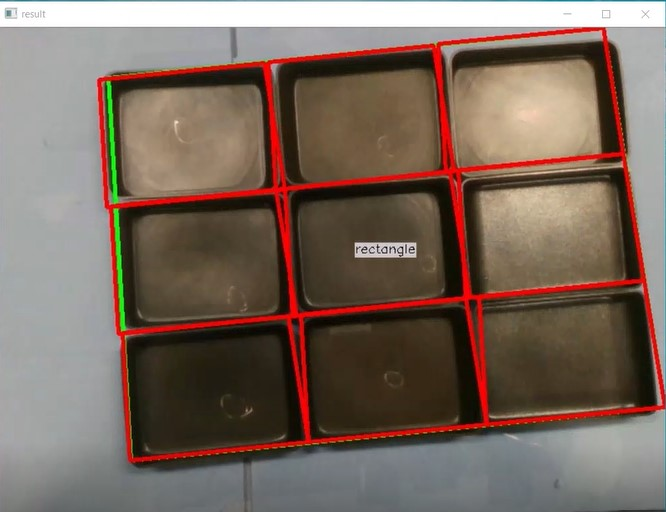

# YUJIN-Mechatronics
비전 카메라 및 센서를 이용한 다단 적재 대상물 위치 추정 

## 주요 과제
* Intel D415 카메라의 오픈소스 librealsense2 활용하여 데이터 획득
* RGB 영상에 엣지, 사각형 검출 알고리즘을 통한 목표 대상물(사각 프라이팬) 범위 검출
* 대상물의 테두리 부분을 depth 데이터로 검출
* 테두리 정보에 Blur와 Morph 처리
* 사각형 검출 및 테두리의 꼭짓점 좌표을 통한 중심 좌표와 거리 정보 획득

## 본인 역할
* Depth 데이터를 통한 사각형 물체의 테두리 추출 및 중심좌표와 거리 정보 획득
* RGB 값과 Depth 값 통합 후 실시간 테스트 구현

## 결과
* 시물레이션: [Youtube](https://youtu.be/Ebg1baApILk)

 

RGB 카메라에서 사각형 검출 테스트

  
  
  

Depth 카메라에서 사각형 검출 테스트

 

  
  
  
###RGB, Depth 센서 정보 통합한 실시간 테스트

 
